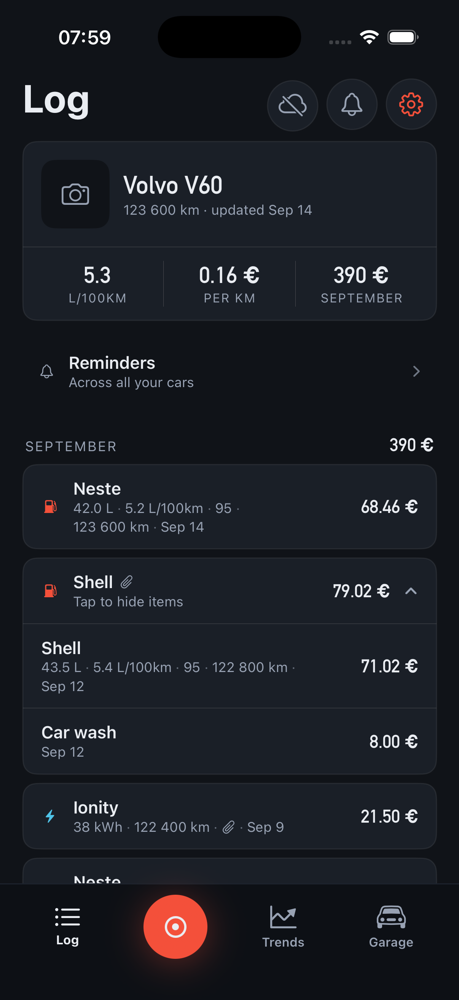
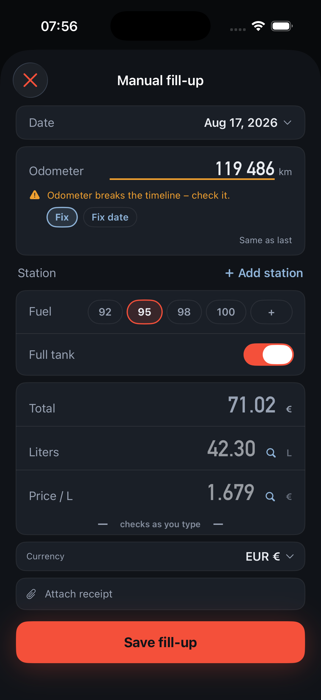
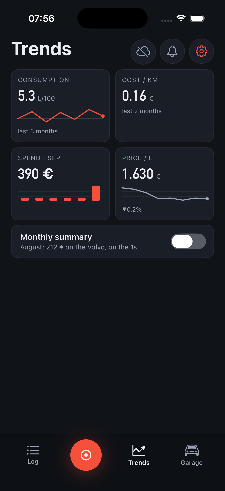

<p align="center">
  
</p>

<h1 align="center">Tankbook</h1>

<p align="center"><b>Fuel &amp; cost log for iPhone.</b> Snap the receipt or type it in – both take seconds.</p>

<p align="center">
  <a href="https://apps.apple.com/us/app/tankbook-fuel-mileage-log/id6807989868"><b>Download on the App Store</b></a>
  &nbsp;·&nbsp;
  <a href="https://tankbook.live/">tankbook.live</a>
  &nbsp;·&nbsp;
  <a href="https://tankbook.live/ru/">По-русски</a>
  &nbsp;·&nbsp;
  <a href="https://tankbook.live/releases/">What's shipped</a>
</p>

<p align="center">
  
  
  
</p>

Tankbook is a car cost log. Fuel, charging, service and the rest – kept on your phone, added in
seconds through either door, checked by arithmetic you can watch.

- **Two doors, always.** Photograph the receipt or the pump display, or type the entry. Neither is a
  fallback: a poor photo means correcting two fields, never starting over.
- **The maths runs where you can see it.** Litres × price has to equal the total. When it does, the
  line locks with a tick; when it doesn't, the odd field gets an amber underline and a tap-to-fix.
- **Your data, yours.** Everything works offline and needs no account. Export is always free. Sign in
  only if you want sync across devices.
- **Every powertrain, every currency.** Litres and kilowatt-hours in one history, each with its own
  consumption maths. A fill-up abroad keeps both amounts, at the rate on the day it happened.
- **Service and reminders.** Service visits, parts, tyres and reminders by date or distance.

Free on the App Store, for iPhone with iOS 18 or later, in English and Russian.
[Privacy](https://tankbook.live/privacy/) · [Terms](https://tankbook.live/terms/) ·
[Support](https://tankbook.live/support/)

## In this repository

| Path | What it is |
|---|---|
| `ios/` | The SwiftUI app (`ios/App`) and the `TankbookCore` Swift package: domain, persistence (GRDB), the receipt and pump readers |
| `backend/` | ASP.NET Core API with PostgreSQL: sync, blobs, the LLM gateway, import parsing |
| `admin/` | The owner's debug-case viewer (a separate service, never part of the public API) |
| `site/` | [tankbook.live](https://tankbook.live/), a Hugo site in EN and RU |
| `ml/pump-reader/` | Training for the on-device pump display reader |
| `Spike/ReceiptSpike/` | The OCR harness and the corpus the readers are measured against |
| `docs/` | The specifications – product, design, journeys, schema, sync, API, security |
| `design/` | Screen mockups, design tokens and the screenshot record |

Contributors start with [`CLAUDE.md`](CLAUDE.md) (the document map and hard rules) and
[`HANDOVER.md`](HANDOVER.md) (current status). The quick build:

```sh
xcodegen generate                 # Tankbook.xcodeproj is generated, never committed
scripts/gate.sh                   # package build + lint + app build + both unit-test bundles
cd backend && dotnet build && dotnet test
```
