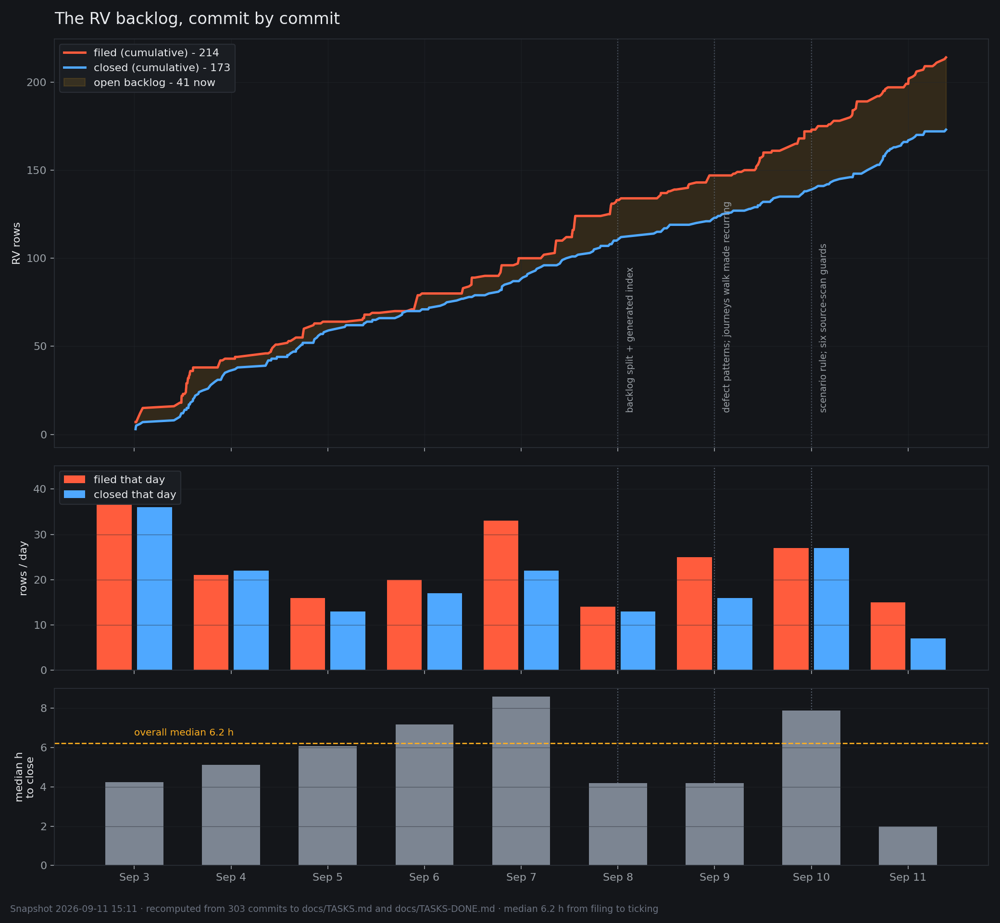

# The RV backlog, and how the way we work changed

**Snapshot: 2026-09-11 09:25 local.** Generated from the git history of `docs/TASKS.md` and
`docs/TASKS-DONE.md` - 498 commits touching those two files, of which 303 fall in the RV era.
Every figure below is recomputed from the files as they stood at each commit, not from memory.

## The headline

| | |
|---|---|
| RV rows ever filed | **214** |
| Closed | **173** (81%) |
| Open right now | **41** - 35 plain, 6 `[!]` |
| First RV row | `RV.1`, 2026-09-03 00:18 |
| Median time from filing to closing | **6.2 h** (n=173) |
| Rows the product owner found by using the app | **101 of 214 (47%)** |
| Rows whose title states an ABSENCE rather than a breakage | **91 of 214 (42%)** |
| Rows dropped without being built | **2** (`RV.94`, `RV.95`, product owner, 2026-09-06) |

The RV series is nine days old. It has absorbed 214 rows in that time and closed four of every
five. It is not a backlog in the usual sense - it is the running record of a review that never
stopped.

## Filed against closed, commit by commit



Built by `scripts/rv-backlog-chart.py`, which re-derives every point from git rather than from a
running tally - re-run it any time and it recomputes from the files as they stood at each commit:

```
python3 scripts/rv-backlog-chart.py            # -> design/analysis/rv-backlog.png + .json
```

Three panels: the cumulative lines with the open backlog shaded between them; rows filed and closed
per day; and the median hours a row waited between being written and being ticked. The dotted
verticals are the process changes described further down, placed at the commit that recorded each -
they are there so the backlog's behaviour on either side of a change can be read off directly.

The two lines run close together and never diverge for long. That is the whole shape of this
period: **work was filed and closed at nearly the same rate**, so the open count stayed between 6
and 33 for eight days while 214 rows passed through it. The gap widens only at the right-hand edge -
the last two days - and the reason is not a slowdown. It is that the rows got bigger.

### The same data by day

| Day | | Filed | Closed | Net | Found by owner | Cum. filed | Cum. closed | Open | Median h to close |
|---|---|---:|---:|---:|---:|---:|---:|---:|---:|
| 2026-09-03 | Thu | 43 | 36 | +7 | 23 (53%) | 43 | 36 | 7 | 4.2 |
| 2026-09-04 | Fri | 21 | 22 | -1 | 10 (47%) | 64 | 58 | 6 | 5.1 |
| 2026-09-05 | Sat | 16 | 13 | +3 | 6 (37%) | 80 | 71 | 9 | 6.1 |
| 2026-09-06 | Sun | 20 | 17 | +3 | 8 (40%) | 100 | 88 | 12 | 7.2 |
| 2026-09-07 | Mon | 33 | 22 | +11 | 19 (57%) | 133 | 110 | 23 | 8.6 |
| 2026-09-08 | Tue | 14 | 13 | +1 | 10 (71%) | 147 | 123 | 24 | 4.2 |
| 2026-09-09 | Wed | 25 | 16 | +9 | 7 (28%) | 172 | 139 | 33 | 4.2 |
| 2026-09-10 | Thu | 27 | 27 | +0 | 14 (51%) | 199 | 166 | 33 | 7.9 |
| 2026-09-11 | Fri | 15 | 7 | +8 | 4 (26%) | 214 | 173 | 41 | 2.0 |

Three things in that table are worth stopping on.

**The open count doubled in the last three days** - 24, 33, 33, 41 - while the closing rate held.
Nothing stalled. What changed is the size of a row: `RV.201` (generalise the late-recognition merge
over entry kind) is not the same unit of work as `RV.2` (choosing a photo from the library did
nothing). The backlog is growing because the rows being filed now are features-worth-of-work, and
because two of the newest four were filed **by an agent reporting a finding it correctly refused to
build** (`RV.212`, `RV.213`, `RV.214`).

**Median time to close is 6.2 hours and has no trend.** It was 4.2 h on day one and 2.0 h today,
with a 8.6 h peak on Monday. A row filed in this project is normally answered the same working day.
The peak on Monday is the sync-and-import series (`RV.101`-`RV.133`), which contained the only rows
that needed backend work.

**Almost half of everything came from the product owner using the app.** 101 of 214. No day fell
below 26%, and on Tuesday it was 71%. This is the single most important number in the document and
the next section is about what it means.

## What kind of work this was

The character of an RV row changed three times in nine days. The titles say it plainly.

**Days 1-3 (Sep 3-5, `RV.1`-`RV.80`) - the app did not work.**
*"The rate pack 400'd on every launch." "Choosing a photo from the library did nothing." "Every
photo taken with the in-app shutter is handed to Vision SIDEWAYS." "`POST /extract` answers 402 for
every v1 user."* These are crashes, wrong status codes, dead tap targets, rotated images. They were
found in minutes by opening the app, and closed in a median of 4-6 hours.

**Days 4-6 (Sep 6-8, `RV.81`-`RV.147`) - the app worked and was wrong.**
*"The 422 import card still clips in Russian." "The Garage attention strip is a tap target that does
not look like one." "The Log shows the newest 20 rows and there is no way to see the rest." "A
'Needs a look' flag on an imported entry can only be cleared by falsifying history." "`POST
/sync/push` costs 578 ms PER RECORD."* Localisation, affordance, performance, data honesty. Nothing
here crashes. Every one of them needed somebody to use the thing and notice.

**Days 7-8 (Sep 9-10, `RV.148`-`RV.199`) - the checks were wrong.**
This is the turn. *"The baseline gate can be fully green on code that does not compile into the
app." "Some committed screenshots cannot be reproduced by the capture script." "About has no
screenshot scroll hook, so its lower half cannot be photographed." "`SyncWriteTriggerTests` fails
under machine load and passes alone."* The defects stopped being about the product and started being
about **the apparatus that proves the product works**. `RV.174` is the emblem: a task could pass
every gate in `CLAUDE.md` and still not compile into the shipping app.

**Day 9 (Sep 11, `RV.200`-`RV.214`) - the feature is uneven.**
*"An Expense scan never recognises WHICH KIND of expense it is." "Late-arriving recognition reaches
a FILL-UP and nothing else." "A service or an expense with no attachment cannot be given one." "A
scanned expense that read everything still cannot be saved."* Every one of these is the same
sentence: **the fill-up path has it and the other entry kinds do not.** The work stopped being
"fix this" and became "the fence stopped one entry kind short, again."

That progression - broken, then wrong, then unverifiable, then uneven - is not a coincidence of what
the owner happened to notice. It is what happens when the cheap defects are exhausted in order.

## What changed in how we work, Monday to Friday

Monday was 2026-09-07. Five days. Four things changed, all of them recorded in `CLAUDE.md` or in a
new file, and all of them a response to something that went wrong.

### 1. The backlog was split in two (Mon 2026-09-08, `bb7f83b`)

`docs/TASKS.md` had become a file where open work and finished work were interleaved, and picking up
a task meant reading closed rows to find live ones. It split into `TASKS.md` (open) and
`TASKS-DONE.md` (closed, with the reasoning that closed them), plus a **generated index**
(`scripts/tasks-index.py`, `--check` fails when stale). Today those files are 886 and 570 lines.

**Why it mattered:** twice this week a finding was filed as new when it was already a row -
`PJ.23` had been PRIORITY since 2026-08-31 and was re-filed as "RV.195's leftover"; `RV.165`
duplicated `RV.110`. An index you can grep is the fix.

### 2. Eight named defect shapes, with the check that catches each (Tue 2026-09-09, `9936629`)

`docs/DEFECT-PATTERNS.md`. Not a style guide - a catalogue of **the shapes this codebase actually
produces**: sibling defects, silently-reachable fallbacks, docs naming behaviour with no call site,
features built on an entity nothing creates. It is now required reading before writing any brief.

**Why it mattered:** the same shape kept arriving under different names. `PJ.28` fixed silent
attachment loss on the expense scan path; its fence stopped there; `RV.149` was the same defect on
the fill-up path; `RV.173` was the same defect on the mixed-receipt path; `RV.202` was the same
defect on the service path. Four rows, one shape, found one at a time over ten days.

### 3. The journeys walk became recurring (Tue 2026-09-09, `d00293f`)

It had run **once**, on 2026-08-29, produced 66 `PJ` rows, and was never repeated - while 643
commits landed after it. It is now scheduled: every 10 shipped rows or at a phase gate, plus four
named trigger events.

**Why it mattered:** every product-reachability gap in the codebase was found either by that one
review or by the product owner using the app. **Never by a test, a code review, or the type
checker.** A review with that hit rate running once was the largest single waste in the process.

### 4. Every task belongs to a scenario, and a scenario is not done until it is reviewed (Thu 2026-09-10, `4ef5192`)

The newest and the largest change. Three parts: every open row names its parent journey
(`scripts/scenario-index.py --check` fails one that does not); when every row naming a scenario is
closed, a **completion review** runs (`agents/briefs/REVIEW-SCENARIO.md`) and only its verdict may
write `Status: implemented`; and a task that changes what the user is promised edits
`docs/JOURNEYS.md` in the same commit.

**Why it mattered, in the owner's own evidence:** J7's Fallbacks sentence promised *"the user
renames/splits by hand"* from the day it was written. `PJ.23` shipped the rename half. Nobody
noticed the split was never filed until the owner opened the screen. **Ticked tasks are what
somebody thought of; the journey is what the user was promised.** Only comparing the two catches the
difference.

### And one more, not in `CLAUDE.md`: the source-scan guard

Seven of these now exist, and **all seven were written in the last two days**:

| Guard | Added | Proves |
|---|---|---|
| `EntityWriterScanner` | 09-10 | every `SCHEMA.md` entity has a production writer |
| `FieldWriterScanner` | 09-10 | every `SCHEMA.md` **field** does too |
| `ScreenRouteScanner` | 09-10 | every screen is reachable |
| `StationMintingScanner` | 09-10 | one station-creation seam, not two |
| `ImportCandidateCopyScanner` | 09-10 | a copy helper cannot drop a field |
| `JourneyLaunchArgumentScanner` | 09-10 | a journey test does not seed past the thing it tests |
| `ReceiptBindingScanner` | 09-11 | the receipt binding has one call site |

Each is a pure function over source text, masking comments, strings and `#if DEBUG`, with a
**reasoned exception list where a blank reason and a stale unused entry both fail the guard's own
self-check**. That last property is what makes them ratchets rather than config files: a guard
reports a dead field behind an exception naming the row that will write it; that row deletes the
exception; the stale check fails until it does. **That loop has closed four times this week** -
`PJ.45`, `PJ.26`, `PJ.63`, and `PJ.22` this morning.

`FieldWriterScanner` is the one that justifies the family. It was built to catch three known dead
fields and reported **eight**, two of which already had briefed writers queued - so it independently
rediscovered rows filed by hand an hour earlier. That is a calibration nobody designed.

## The through-line

Every change this week moved verification **earlier and into code**:

- Monday: a stale index **fails a check** instead of being noticed by a reader.
- Tuesday: a known defect shape is **written down** instead of being rediscovered.
- Tuesday: the highest-yield review is **scheduled** instead of remembered.
- Wednesday-Thursday: seven invariants become **executable guards** instead of conventions.
- Thursday: a scenario's completeness becomes **a gate with a verdict** instead of a tick count.

And the thing that has not changed, and should not: **the orchestrator verifies by exit code and
opens every screenshot personally.** Agents have no image input; XCUITest asserts behaviour and
never colour. Every defect shipped this week was caught by a hand-run mutation or by looking at a
picture - three of them on work from the strongest model tier. The guards catch shapes. They do not
catch a truncated Russian label, and nothing except a person looking at the frame ever will.

## Caveats on these numbers

- Row state is parsed from the markdown at each commit. Rows whose id carries a version marker
  (`RV.118 **[v1.1]**`) needed a looser pattern than the first pass used; the figures here are from
  the corrected pass, which reconciles exactly with a direct count of the files today (41 open).
- "Found by the product owner" is a grep for *product owner* in the row's text at the moment it was
  filed. A row that records the owner's involvement only in its outcome is not counted, so **47% is
  a floor, not a ceiling.**
- "Closed" counts `[x]` and `[cut]`. Time-to-close is measured between commits to the task files,
  which is when a row was written and when it was ticked - not when the code was written.
- The subject-area classification in *What kind of work this was* is read from row titles by hand,
  not by keyword. An automated pass left 30% uncategorised and is not reported here, because a
  taxonomy that misses a third of its input would be worse than prose.
